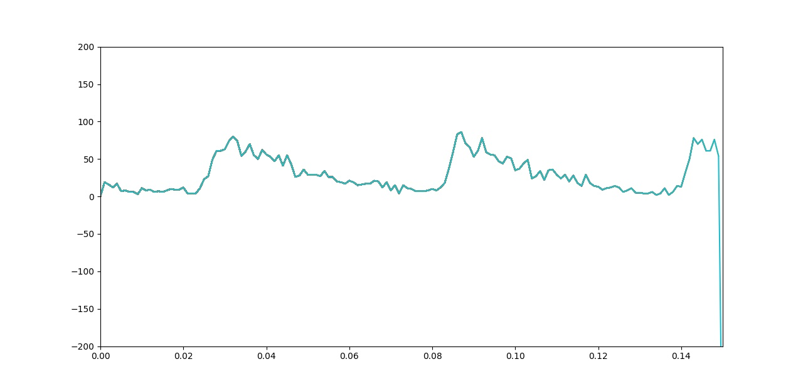
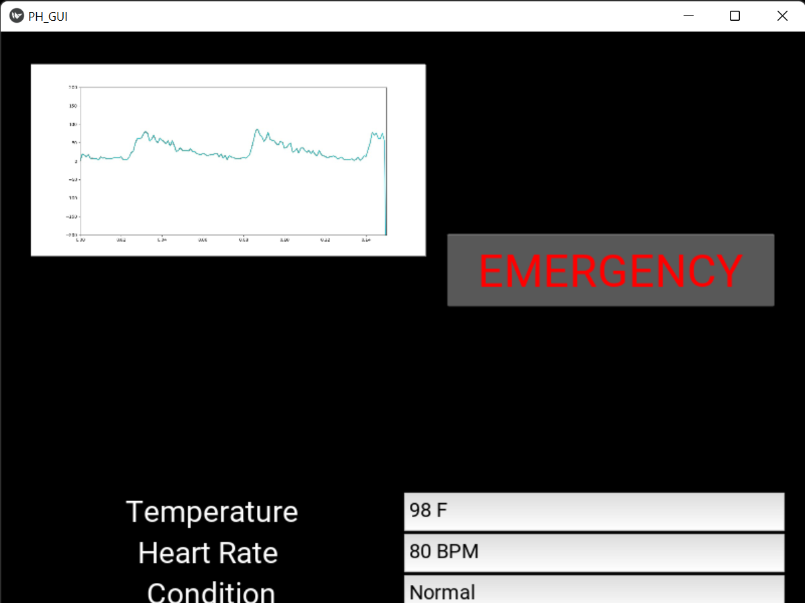

{\rtf1}

# CLARA: a Portable Ambulatory ECG Device

CLARA is a **Raspberry Pi** based device which uses **AD8232 ECG Sensor** to collect the data. used **Python** and **Serial Library** to take input from the sensor. **Matplotlib** Library is used to visualize the data. Data is Logged onto **Firebase Database** using **REST API**. The GUI has been implemented in **kivy** framework.

The ECG Visualization.

The GUI implemented in Kivy
